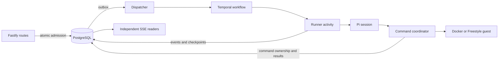

# Backend audit of the current working tree

Audit date: September 11, 2026, America/Phoenix. Verification completed on September 12 UTC.

Baseline commit: `1469ee111c4bae5bfcd23ec23c62dbe47de876c6`. This audit includes the modified and untracked files present during the review. It is a whole-backend audit, not a review of the diff against that commit.

No application code, tests, configuration, migrations, or existing documentation were edited. This report is the only repository artifact added by the audit. Diagnostic reproductions used memory or temporary files. No live Freestyle resources, model calls, or paid tests were used.

## Assessment

Keep the architecture. PostgreSQL, Temporal, Pi, and the sandbox coordinator each have a real responsibility in this product. The durable conversation model, transactional admission, command reconciliation, and filesystem generations are justified even for a resume project. They are the features that make this more than a chatbot wrapped around a shell.

The backend is not ready to present as reliably complete. There are several concrete integration bugs in ordinary tool use, recovery cancellation, model-visible output, and SSE initialization. The database also has a reproducible migration-generation problem. Fix these before expanding the infrastructure or adopting more Effect APIs.

The largest unnecessary complexity comes from overlapping coordination mechanisms. Pi execution now uses Effect scopes, queues, and Deferred acknowledgments, but still carries multiple custom Promise races, abort listeners, timers, failure latches, and cleanup paths. The next Effect change should remove that duplication within the existing attempt boundary. Converting more modules for consistency would make the project harder to explain.

For a GitHub portfolio, a working quickstart, returning-user conversation history, a reliable multi-tool run, and a demonstrated recovery sequence matter more than additional infrastructure. The project already has substantial correctness machinery and useful tests. It needs a tighter integration story and fewer competing descriptions of what is implemented.

## Scope and evidence

The review covered runner execution and lifecycle, the dispatcher, sandbox adapters, guest programs, repository initialization, snapshot tooling, HTTP routes, SSE, authentication, configuration, transactional persistence, schema, migrations, tests, and backend documentation. Parallel reviews examined runner behavior, API/server/auth, and database invariants. Findings were reconciled across their callers.

Excluded from product review were `apps/web/**`, `packages/api/src/client.ts`, and `packages/env/src/web.ts`. Browser-facing exports were not proposed for modification. Vendored dependencies and vendored lint rules were reference material, not a separate third-party source audit. Root tooling and lint configuration were reviewed for their effect on backend maintenance.

The runtime source inventory is:

| Area                                                |  Files | Physical lines |
| --------------------------------------------------- | -----: | -------------: |
| Runner TypeScript and guest Python                  |     24 |          8,457 |
| Server TypeScript                                   |      2 |            141 |
| Server-side API TypeScript                          |      7 |            880 |
| Database TypeScript, including schema               |     10 |          3,187 |
| Authentication TypeScript                           |      2 |            101 |
| Backend environment TypeScript                      |      5 |            166 |
| **Application total**                               | **50** |     **12,932** |
| Freestyle shell, systemd, and capability-list files |     10 |            703 |

These are physical lines, including comments and blanks. SQL migrations, tests, dependency files, Dockerfiles, and documentation are additional. Counts came from enumerating these directories and summing `splitlines()` for `.ts`, `.py`, `.sh`, `.service`, and `.list` files, excluding migrations and the two browser files above. They measure size, not quality.

The largest application modules are `packages/db/src/threads.ts` at 1,847 lines, `apps/runner/src/pi.ts` at 1,406, `activities.ts` at 924, and `freestyle.ts` at 897. A large file is not automatically a design problem. The relevant question is whether its callers must repeat its invariants or cleanup rules.

Evidence labels in this report mean:

- **Reproduced:** a runnable local check demonstrated the behavior. The check's scope is stated.
- **Source-verified:** the actual implementation and relevant callers or installed dependency code establish the finding, but the full scenario was not executed.
- **Design judgment:** a recommendation or product tradeoff, not a claimed runtime defect.

P1 means fix before presenting the affected feature as reliable. P2 means a concrete but narrower correctness or maintenance issue. Product additions and optional hardening are kept separate from those severities.

## Priority findings

| ID  | Priority | Finding                                                                    | Evidence                                                      |
| --- | -------- | -------------------------------------------------------------------------- | ------------------------------------------------------------- |
| F1  | P1       | Pi's parallel tool scheduling conflicts with serialized workspace commands | Source-verified against installed SDK                         |
| F2  | P1       | Recovery execution escapes the run's cancellation scope                    | Source-verified                                               |
| F3  | P1       | Successful reads and shell output silently stop at 4 KiB for the model     | Reproduced through actual tool definition                     |
| F4  | P1       | SSE initialization can leak readers and hang shutdown                      | Two real HTTP reproductions                                   |
| F5  | P2       | Structured guest responses use a larger budget than their stdout channel   | Guest helper reproduced; transport mismatch source-verified   |
| F6  | P2       | Automatic HTTP logs retain OAuth callback code and state                   | Reproduced                                                    |
| F7  | P2       | Drizzle generation starts from stale migration snapshots                   | Reproduced in memory                                          |
| F8  | P2       | The documented all-in-one development command omits the dispatcher         | Source-verified                                               |
| F9  | P2       | Ignored skill content can prevent any Pi execution                         | Guest discovery reproduced                                    |
| F10 | P2       | Attempt ownership does not fence event writes                              | Store boundary source-verified; overlap scenario not executed |
| F11 | P2       | Checkpoint sanitization removes useful project-tool failure context        | Decoder reproduced                                            |

### F1. Support parallel Pi calls through safe coordinator scheduling

The four definitions at [pi.ts:926](/Users/anmolhurkat/Developer/cloud-swe/apps/runner/src/pi.ts:926) omit `executionMode`. The installed Pi 0.85.1 agent-core defaults `toolExecution` to `parallel`. The coding-agent SDK constructs that agent without changing the default. Its loop selects sequential execution if the global setting or a called tool requests it.

An assistant response containing two reads can therefore call the coordinator concurrently. [execution-coordinator.ts:475](/Users/anmolhurkat/Developer/cloud-swe/apps/runner/src/execution-coordinator.ts:475) rejects execution when it finds an unsettled command. If both calls pass that lookup, the unique unsettled-operation index rejects the second database insert. `remoteExec` treats the rejection as an unknown transport outcome and aborts Pi.

The current database rule correctly prevents overlapping commands, but the coordinator treats normal contention from parallel tool calls as a fatal error.

The selected remediation, updated after the audit at the user's request, is to keep Pi's parallel tool calling enabled and support safe scheduling in the coordinator. Do not set the custom tools to `executionMode: "sequential"`. The following requirements describe planned behavior, not the audited implementation.

#### Required scheduling behavior

- Allow bounded concurrent `remote_read` operations within the same workspace generation. Only the dedicated, validated read tool may request shared access. The runner assigns this classification; the model and guest cannot declare arbitrary commands safe.
- Give `remote_write`, `remote_edit`, and every arbitrary `remote_exec` command exclusive access. Repository preparation and resource discovery remain exclusive unless separately proven safe. Do not infer read-only behavior by parsing shell text.
- Prevent coordinated reads from overlapping an exclusive operation, and prevent exclusive operations from overlapping each other. Shared access refers to reading user workspace files; command journal/status writes still need their own safe bookkeeping.
- Queue compatible pending calls with bounded admission instead of failing an attempt because another healthy command is active. Once an exclusive operation is waiting, later reads must not continually bypass it. A caller waiting for capacity must remain cancellable.
- Keep per-command identity, execution ownership, workspace generation, durable status, and reconciliation for every dispatched operation. Update database admission/constraints and guest locking together to permit shared reads while preserving exclusive mutations. A process-local queue alone cannot establish these guarantees after worker loss.
- Never dispatch a cancelled or superseded waiter. Reconcile every in-flight ambiguous operation before admitting conflicting work. An unknown read outcome still blocks mutations and lifecycle operations until it is resolved. Ordinary active contention must stay distinct from unknown outcomes and quarantine.
- Pause, deletion, replacement, and attempt handoff must account for all outstanding operations. Preserve active-run guards, and retain the generation's ownership while any dispatched operation remains unresolved. Ordinary lifecycle cleanup stays blocked. Existing fenced quarantine recovery may tear down the old VM to resolve an irreconcilable operation, but must confirm deletion or absence before settling ownership or replacing the generation. An ambiguous teardown retains quarantine.
- Keep persistence writes ordered through the existing attempt writer. Concurrent tools retain independent tool-call IDs and their own start/output/completion order; do not require independent tool results to finish in request order.

Tool execution stays inside the existing Temporal activity. Temporal owns activity retry and cancellation; the coordinator owns tool scheduling. Do not create one Temporal activity per tool call, put Effect in workflow code, or add a new queue service. Use existing Effect resource/concurrency primitives where they reduce local coordination, alongside PostgreSQL admission and guest fencing.

The schedule constrains coordinator-dispatched operations. It does not promise a frozen filesystem against an already-running background process or arbitrary guest code.

#### Acceptance checks

1. A real installed-SDK assistant turn containing two reads overlaps their execution and completes both successfully. Invoking injected tools individually is insufficient.
2. A mixed read/write/shell batch waits for conflicting operations, never overlaps a mutation with another coordinated operation, and completes without a contention-induced attempt failure.
3. Read concurrency and pending admission remain bounded. An exclusive waiter makes progress under continuing read requests.
4. Cancelling a queued call prevents dispatch. Cancelling an active batch tracks and reconciles every dispatched command, including transport-ambiguous reads.
5. Worker loss or ownership replacement with multiple active reads prevents stale dispatch and conflicting mutations until reconciliation completes. Legacy unsettled commands remain exclusive during migration.
6. Ordinary pause, deletion, and filesystem replacement remain blocked while any command is active or unresolved. Fenced quarantine teardown releases ownership only after confirmed provider deletion or absence; an ambiguous teardown keeps conflicting work blocked. Verify these rules with real database admission and guest fencing, not only an in-memory scheduler.
7. Concurrent tool events retain their identities and per-tool order, accepted persistence writes drain before success, and a persistence failure stops the whole attempt.

This is a deliberate expansion of coordinator capability and requires a schema/guest-protocol change with migration and recovery tests. It preserves parallel tool calling without weakening the one-mutating-operation invariant.

### F2. Keep recovery inside the active cancellation scope

[workflows.ts:311](/Users/anmolhurkat/Developer/cloud-swe/apps/runner/src/workflows.ts:311) runs initial preparation and execution inside `CancellationScope.cancellable`. It stores that scope in `activeScope`. The catch block at line 317 calls `recoverOrFinalize` outside it. Recovery starts another `prepareAndExecute` at [workflows.ts:210](/Users/anmolhurkat/Developer/cloud-swe/apps/runner/src/workflows.ts:210).

During replacement execution, the cancel handler still calls `cancel()` on the old scope. It does not interrupt the replacement activity. The database cancellation flag prevents eventual success, but the Pi path checks that flag around the model execution rather than continuously during it. A recovered run can keep using compute and modifying its workspace after cancellation was requested.

Keep recovery execution inside the current run's cancellable scope, or establish a new scope and update `activeScope` when recovery begins. Durable finalization should remain explicitly noncancellable.

Test an initial `WORKSPACE_REPREPARE` failure, a replacement activity waiting for cancellation, and a `cancelRun` signal. Verify that the replacement receives cancellation and the run reaches `cancelled`. The current first-execution cancellation test does not cover this branch. Preserve Temporal replay compatibility when changing workflow command ordering.

### F3. Send actual bounded output to the model

[pi.ts:60](/Users/anmolhurkat/Developer/cloud-swe/apps/runner/src/pi.ts:60) sets `maxDiagnosticBytes` to 4,096. `diagnosticText` applies that limit, and both `remote_exec` and `remote_read` use the diagnostic as their model-visible text at [pi.ts:934](/Users/anmolhurkat/Developer/cloud-swe/apps/runner/src/pi.ts:934) and [pi.ts:951](/Users/anmolhurkat/Developer/cloud-swe/apps/runner/src/pi.ts:951).

The configured command allowance is much larger. The full output survives in `details`, but the tool's text content silently loses its tail. The `outputTruncated` flag remains false when the larger command allowance was not exceeded.

A reproduction invoked the actual `remote_read` definition through an injected session. The provider returned 20,011 bytes ending in `TAIL_MARKER`:

```json
{
  "sourceBytes": 20011,
  "modelContentBytes": 4096,
  "modelHasTail": false,
  "detailsOutputBytes": 20011,
  "outputTruncated": false
}
```

This can hide later functions in a source file or the final errors from a test command. It directly affects the agent's ability to edit correctly.

Return the full bounded output in the tool's content. Reserve the short diagnostic for summaries or error descriptions. Any truncation of the model-visible text must be explicit. Test a trailing marker beyond 4 KiB and below the configured output limit.

### F4. Own the SSE reader before its first database await

[thread.ts:423](/Users/anmolhurkat/Developer/cloud-swe/packages/api/src/routers/thread.ts:423) waits for authorization and the first event batch before installing cancellation listeners. It commits headers at line 434, creates the controller at line 447, and registers the stream at line 457. The shutdown hook only sweeps streams already registered.

Two local HTTP reproductions confirmed the consequences:

1. Disconnect while the first event read is blocked, then resolve it. The response is already destroyed, but the handler creates a new polling loop after the close event has passed. With a 10 ms polling interval, the reproduction observed nine additional database reads in the next 100 ms.
2. Begin server shutdown while the first event read is blocked, wait for `preClose`, then resolve it. The handler opens a 200 SSE response after the shutdown sweep. `server.close()` remains pending until the client disconnects.

Retain authorization and first-read-before-headers behavior, but register request lifetime and cleanup before those awaits. Set a closing flag in `preClose` and recheck both shutdown and socket state before hijacking. Failed authorization or initial reads must remove the same registration.

The existing Effect stream's ordered polling and backpressure do not need replacement. This defect is in the Fastify initialization boundary. Add tests for both initialization windows alongside established-reader shutdown tests.

### F5. Derive structured-response limits from the actual stdout allowance

The command wrapper allocates half the configured output limit to stdout and half to stderr at [guest-command.ts:262](/Users/anmolhurkat/Developer/cloud-swe/apps/runner/src/guest-command.ts:262). Other code assumes stdout can use the entire limit.

The edit helper sizes its JSON response against the full allowance at [file-tools.py:99](/Users/anmolhurkat/Developer/cloud-swe/apps/runner/src/guest/file-tools.py:99). A 64 KiB diff is not necessarily a 64 KiB JSON response because `ensure_ascii=True` expands non-ASCII characters.

A local helper reproduction replaced a line of 6,000 emoji with another such line. The file changed successfully. The response was **144,431 bytes**, with `diffTruncated: false`. The default coordinated stdout allowance is **131,072 bytes**. The wrapper would truncate a result describing an already-completed edit, causing the caller to report an output-limit error instead of receiving the structured success. This check ran the guest helper with its workspace root relocated to a temporary directory; it did not execute a live provider command.

The same assumption appears in resource paging at [remote-resources.ts:288](/Users/anmolhurkat/Developer/cloud-swe/apps/runner/src/remote-resources.ts:288). With a valid configured output budget of 65,536 bytes, it can request a base64 page of about 65 KiB while the wrapper retains only 32 KiB of stdout. The default page size happens to fit the default configuration.

Define the channel allowance once and use it for edit JSON, resource pages, and any other structured stdout response. Account for encoding and framing before executing a mutation. `ensure_ascii=False` can reduce JSON expansion, but it does not fix the underlying budget disagreement on its own.

Add a Unicode-heavy edit and a resource-page transfer under a smaller configured limit through the actual coordinator. The current remote-tools tests call a raw Docker execution helper and therefore miss the coordinator's channel split.

### F6. Sanitize automatic request URLs as well as caught errors

[app.ts:25](/Users/anmolhurkat/Developer/cloud-swe/apps/server/src/app.ts:25) enables Fastify's default request logger. It logs the complete request URL. GitHub OAuth callbacks carry authorization codes and state in that URL.

An injection reproduction requested an auth callback with synthetic `code` and `state` values. Both appeared in the ordinary incoming-request log. The safe `publicFailure` mapping does not affect this automatic logger.

OAuth codes are normally short-lived and single-use, which limits the exposure. They still have no useful place in application request logs.

Configure the existing logger's request serializer to record a safe path or omit sensitive auth query parameters. Header redaction does not remove secrets embedded inside `req.url`. Test captured automatic callback logs, rather than only explicitly caught errors.

### F7. Repair migration-generation metadata

The [migration journal](/Users/anmolhurkat/Developer/cloud-swe/packages/db/src/migrations/meta/_journal.json:61) includes 0008 and 0009, but the newest schema snapshot is still `0007_snapshot.json`.

The installed Drizzle Kit generation API was exercised in memory with that snapshot and the current schema. It generated creation of `run_execution_owner`, all four demo tables, five existing run columns, and a drop of `run_one_active_user_idx`, which migration 0009 already drops.

Applying the current migrations to a fresh database is a different operation and can succeed. The problem appears on the next schema change: `db:generate` produces a follow-up migration that attempts to recreate existing objects.

There is additional schema drift in [0009_demo_policy.sql](/Users/anmolhurkat/Developer/cloud-swe/packages/db/src/migrations/0009_demo_policy.sql). Several SQL constraints receive PostgreSQL-generated names while the TypeScript schema declares explicit names. SQL constrains `observed_seconds >= 0`; the corresponding TypeScript declaration does not.

Repair the snapshots and align the schema's constraints with applied SQL. Preserve already-applied migration history. A no-change generation against the repaired snapshot should emit no SQL. Add that check to schema verification; fresh-database migration tests alone cannot catch this problem.

### F8. Make the quickstart launch the dispatcher

The [README quickstart](/Users/anmolhurkat/Developer/cloud-swe/README.md:22) ends with `bun run dev`. The local guide also claims that this starts all application processes.

The root command is `turbo run dev`. The [runner dev script](/Users/anmolhurkat/Developer/cloud-swe/apps/runner/package.json:6) launches only the worker. Its dispatcher command is a separate script, and no participating package's `dev` script starts it.

A clean quickstart can therefore accept submissions and leave them queued in PostgreSQL because no process delivers the outbox records. The separate-terminal instructions in the local guide include the dispatcher and are correct.

The smallest repair is to make the README show the actual required commands and remove the incorrect all-in-one claim. A combined development command is also reasonable, but does not need a new process-management framework. Keep the worker and dispatcher responsibilities distinct even if one development entry point starts both.

Verify the documented path from a fresh local environment by submitting one scripted run and observing completion.

### F9. Apply resource exclusion before reading excluded content

[guest/resources.py:45](/Users/anmolhurkat/Developer/cloud-swe/apps/runner/src/guest/resources.py:45) reads Markdown under both skill roots before the TypeScript resolver applies ignore files. Excluded content therefore counts against the resource-file and content limits and can fail decoding.

A local reproduction placed `ignored.md` in `.agents/skills`, listed it in `.ignore`, and gave it 65,537 bytes. The guest program exited with `Project resource discovery could not complete within its safety limits`. Pi never reached execution. The workspace root was relocated in memory to a temporary directory for the check.

The broader traversal also visits nearly the entire workspace, excluding only `.git` and `node_modules`. Generated Python environments or build trees can exhaust the 10,000-entry limit even if they contain no relevant instructions. The explicit bound is sensible. Charging unrelated generated content against instruction discovery makes ordinary projects unnecessarily fragile.

Preserve the limits and scoped instructions. Apply skill exclusion before content loading, and narrow traversal or use staged discovery so irrelevant files do not become required resource payloads. Keep one implementation of the discovery policy instead of separate approximations in Python and TypeScript.

Do not enable Pi's worker-local resource discovery as a shortcut. It would violate the sandbox boundary. Test an oversized ignored skill and a workspace with a large generated subtree.

### F10. Extend the existing owner token to attempt event writes

[threads.ts:918](/Users/anmolhurkat/Developer/cloud-swe/packages/db/src/threads.ts:918) rejects events for terminal runs, but does not validate the execution token, attempt identity, or workspace generation. Attempt event callbacks in [activities.ts:692](/Users/anmolhurkat/Developer/cloud-swe/apps/runner/src/activities.ts:692) retain their original attempt identity and call this operation without a token.

The activity scope deliberately bounds cleanup. An underlying Promise or database operation can remain pending after the lock connection is destroyed. If attempt B takes ownership while a late event from A is still waiting, the store will accept A's event while the run remains active. A late `assistant.started` can appear after B's start and confuse the documented attempt-replacement replay rule.

This is a verified omission in the store's authorization conditions and a credible overlap scenario. It was not reproduced against a running database during this audit. Checkpoint writes and final assistant completion are already fenced correctly; this finding does not invalidate those fixes.

Pass the existing immutable ownership token through attempt event writes and check it in the event transaction. Do not introduce another lease or local revision system. Test A writing, B claiming ownership, and A attempting a late event while B's state remains unchanged.

`beginCommand` also does not check the execution token. The coordinator does recheck cancellation before dispatch, so this review does not claim a demonstrated stale remote mutation from that omission. Strengthening it with the same token is a related defense improvement, not evidence that concurrent guest mutation was observed.

### F11. Preserve safe project-tool failure facts in checkpoints

[checkpoint.ts:278](/Users/anmolhurkat/Developer/cloud-swe/packages/db/src/checkpoint.ts:278) replaces every error tool result with `Agent execution failed` and removes its details. This protects against arbitrary SDK exception text reaching durable storage.

However, [remote_edit](/Users/anmolhurkat/Developer/cloud-swe/apps/runner/src/pi.ts:972) throws an ordinary error for a known guest edit failure. A resumed conversation loses useful facts such as an ambiguous literal match. A decoder reproduction supplied a `remote_edit` error containing a match count and restored only generic text with no details.

Use a small validated result for project-owned guest failures, with stable codes and bounded safe fields. Preserve those facts through checkpoints while continuing to sanitize arbitrary SDK/provider exception text. Do not add a blanket exemption for anything named `remote_edit`; guest data still crosses a trust boundary.

Test a failed literal edit through the tool-result and checkpoint round trip. Keep the existing credential-leak tests.

## Product ethos and claims

| Claim or decision                                  | Current evidence                                                                     | Judgment                                                                                  |
| -------------------------------------------------- | ------------------------------------------------------------------------------------ | ----------------------------------------------------------------------------------------- |
| Browser connections do not own runs                | HTTP submission commits durable work; SSE is a separate reader                       | Correct architecture. F4 is a reader-lifetime bug, not browser-owned execution            |
| Conversations survive reconnection and worker loss | PostgreSQL messages/events/checkpoints, outbox delivery, Temporal recovery           | Substantially implemented. F2 and F10 narrow the recovery guarantee                       |
| Coding tools operate remotely                      | Custom Pi tools call the coordinator; worker-local tools and extensions are disabled | Preserve. F1 and F3 currently undermine normal tool use                                   |
| One mutating operation per workspace generation    | Database uniqueness plus guest lock and reconciliation                               | Preserve while extending the coordinator for shared reads and queued exclusive operations |
| Final state and messages are durable and atomic    | Token-fenced checkpoints and transactional completion                                | Strong part of the codebase                                                               |
| Workspace persistence means files are never lost   | The current docs explicitly warn that deletion loses local work                      | The docs correctly avoid this promise. Keep the warning and generation-reset notice       |
| Owner and visitor policies are cost controls       | Three visitor turns, provider/runtime caps, database reservations                    | Reasonable for a hosted portfolio demo. More complex than the core coding feature         |
| Effect adoption reduced LOC                        | The adoption report records production growth                                        | Do not claim a reduction. Evaluate the next change by net deletion and clearer ownership  |
| The snapshot proves current live behavior          | The manifest explicitly marks the release as historical after recipe changes         | Honest limitation. Local doubles cannot certify the changed provider policy               |
| Returning users can find durable conversations     | Lookup by thread UUID exists; an owner-scoped list does not                          | Backend product gap worth filling before more infrastructure                              |
| Desktop/CUA is an implemented agent feature        | Snapshot tooling installs the components; Pi exposes four shell/file tools           | Installed capability is preparation, not end-to-end computer-use integration              |

### The most useful missing backend feature is thread discovery

The canonical API creates a thread and retrieves one by UUID. There is no owner-scoped thread-list endpoint or matching `ThreadStore` operation. A caller that loses its locally remembered IDs cannot ask the backend to discover its conversation history.

This is not a violation of the current endpoint contract, and it does not require inspecting the frontend. It is a gap in the returning-user story. A small paginated list containing IDs, titles, timestamps, and relevant status would make durable threads usable from another browser or device. Full conversation content should stay on the detail endpoint.

### Cost controls should remain conservative, but smaller policies deserve consideration

The five-VM ceiling, application run admission, provider runtime caps, and owner/demo distinction address real constraints. Paused and unrelated VMs counting against provider capacity is not a bug. Neither is retaining a reservation when a timeout leaves the provider outcome unknown.

The monthly ledger is the most elaborate policy in the new code. [demo-compute.ts](/Users/anmolhurkat/Developer/cloud-swe/apps/runner/src/demo-compute.ts:24) combines raw SQL transactions, cumulative runtime observations, uncertain start bounds, and per-month minimum/maximum allocation across four tables. It enforces a stricter accounting promise than a small demonstration necessarily needs.

Keep it if accurate reuse of confirmed unused capacity is an intended feature. If a later policy change is acceptable, compare it with a simpler pessimistic allowance that charges a full fixed session reservation. That would be easier to explain but could reject more visitors and would need an explicit month-boundary and ambiguous-outcome policy. It is not a drop-in deletion that preserves today's semantics.

Do not clear unknown reservations merely to reopen capacity. If uncertainty permanently consumes the demo allowance, the operator needs a deliberate reconciliation procedure with provider evidence. The current fail-closed behavior should be documented as a possible availability outcome.

Owner retention also has an operational consequence: five retained owner VMs can occupy all five total slots even while paused. Visitor capacity then stays unavailable. Reserve room operationally or retire known-unused owner resources deliberately; do not add automatic eviction of other workspaces.

The twenty-minute VM reservation against an 18,000-second allowance permits at most fifteen fully reserved demo VM starts at once across unresolved accounting, before confirmed settlement returns unused capacity. This is conservative cost control, not a throughput target. Model costs are outside that ledger.

### Add a small SSE connection bound if the demo is public

After F4 is fixed, the API still allows an unbounded number of simultaneous readers. Each reader polls independently, normally every 200 ms. One hundred idle readers imply roughly 500 queries per second before query latency, even for an account that has exhausted its compute turns.

A process-local per-user and global reader cap is sufficient for this single-server project. Reject before headers. Preserve normal multiple tabs and independent cursors. Redis, shared cursors, and a fanout service are unnecessary here. This is a static resource-bound observation, not a measured production incident.

## Simplification and dead code

The following order balances deletion, risk, and usefulness. Estimates are recommendations, not measured results from an implementation. No net reduction is claimed because this audit makes no code changes.

| Rank | Candidate                                                       | Existing replacement                                            | Expected benefit and limits                                                                   |
| ---- | --------------------------------------------------------------- | --------------------------------------------------------------- | --------------------------------------------------------------------------------------------- |
| 1    | Repeated Pi timeout, cancellation, and cleanup machinery        | Existing Effect scope, interruption, timeout, and Deferred APIs | Largest plausible coordination reduction; requires behavior-preserving work and failure tests |
| 2    | Database update-then-select sequences                           | Drizzle `.returning()`                                          | Four fewer reads and approximately 30 to 45 removable lines                                   |
| 3    | Coordinator error to generic transport to new error conversions | Retain typed failure alongside public diagnostic                | Fewer conversions; clearer recovery routing                                                   |
| 4    | Duplicate ownership/trusted-compute reads before admission      | One narrow API account-facts lookup                             | Fewer repeated queries; retain the authoritative transactional owner check                    |
| 5    | Unused helpers, aliases, accessors, and dependency              | Delete                                                          | Small, high-confidence cleanup with no new abstraction                                        |
| 6    | Repeated shell quoting and UTF-8 truncation                     | One small shared implementation of each                         | Small deletion and consistent boundary handling                                               |
| 7    | Manual scripted sleep and server resource shutdown plumbing     | Node timer promises and Fastify close hooks                     | Small native replacements                                                                     |
| 8    | Redundant persisted fields and unused ORM relations             | Existing typed columns and explicit queries                     | Less schema/storage clutter; perform with normal migration discipline                         |
| 9    | Interleaved large-module responsibilities                       | Cohesive private groups or a small number of owning modules     | Readability improvement only; moving lines is not deletion                                    |

### Use the features already in Drizzle and PostgreSQL

At [threads.ts:1227](/Users/anmolhurkat/Developer/cloud-swe/packages/db/src/threads.ts:1227), [1268](/Users/anmolhurkat/Developer/cloud-swe/packages/db/src/threads.ts:1268), [1565](/Users/anmolhurkat/Developer/cloud-swe/packages/db/src/threads.ts:1565), and [1801](/Users/anmolhurkat/Developer/cloud-swe/packages/db/src/threads.ts:1801), an update is followed by a lookup of the same record. Use `.returning()` where the operation needs the updated row.

`getThread` already selects the thread's event sequence. Its additional latest-event query at [threads.ts:726](/Users/anmolhurkat/Developer/cloud-swe/packages/db/src/threads.ts:726) can use that value, preserving the existing no-event representation when the sequence is zero.

The original-run lookup at [threads.ts:286](/Users/anmolhurkat/Developer/cloud-swe/packages/db/src/threads.ts:286) duplicates the message's non-null run foreign key and `ON DELETE SET NULL` invariant. `readWorkspaceForThread` at line 468 has one caller, which always passes `lock: true`; its unused option can disappear. `persistRecoveredProviderId` also has an unreachable fallback after an explicit missing-row throw.

None of these improvements needs an Effect wrapper, generic repository interface, or new library.

### Delete only what has no current responsibility

Repository-wide caller searches found these small candidates:

- [http.ts:15](/Users/anmolhurkat/Developer/cloud-swe/packages/api/src/http.ts:15): `sendFailure` has no callers. The active routes use a different error policy. Delete its 15 lines rather than creating callers to justify it.
- [pi-persistence.ts:130](/Users/anmolhurkat/Developer/cloud-swe/apps/runner/src/pi-persistence.ts:130): `retainedItemCount` and `retainedPayloadBytes` have no consumers. The exported default item/byte constants near the end of the file are also unused. Keep the internal counters and limits.
- [pi.ts:722](/Users/anmolhurkat/Developer/cloud-swe/apps/runner/src/pi.ts:722): `assertPiCheckpointSize` is exercised by tests while production repeats its logic. Test the production path and remove the duplicate, or make production use the helper if that is smaller.
- [pi.ts:687](/Users/anmolhurkat/Developer/cloud-swe/apps/runner/src/pi.ts:687): `piSessionMetadataFromContent` is an alias of the parser. Use the parser directly where compatibility does not require the alias.
- [config.ts:41](/Users/anmolhurkat/Developer/cloud-swe/apps/runner/src/config.ts:41): `_production` is unused. The earlier Freestyle minimum-runtime check is weaker than the later check that adds cleanup and idle grace. Consolidate validation and keep provider-specific checks attached to the relevant provider.
- [auth package.json](/Users/anmolhurkat/Developer/cloud-swe/packages/auth/package.json): the package declares Zod without importing it in either source module. Removing this declaration does not remove Zod from the backend. `plugins: []` in auth options also adds no behavior.
- [thread.ts:20](/Users/anmolhurkat/Developer/cloud-swe/packages/api/src/routers/thread.ts:20): both a user ID and a full session are retained on the request, while the session's later use repeats the same ID. Keep only the facts the route needs after authentication.

`runPi` and `runScripted` remain registered Temporal activity names even though current workflows use `runExecution`. Current source and captured histories do not call them, but persisted external histories can outlive current source. Remove those exports only after checking supported deployment histories. That qualification does not apply to ordinary uncalled private helpers.

The `outbox.payload` field duplicates typed thread/run columns; the dispatcher uses those columns and never consumes the payload. Remove the duplicate field when the schema is next changed. Several thread/run/workspace/command Drizzle relation declarations also have no relational-query consumers. Keep auth relations until Better Auth's adapter requirements are confirmed.

### Remove repeated conversions, not useful validation

Shell quoting is implemented in `guest-command.ts`, `repository.ts`, and `remote-files.ts`. A dependency-free helper avoids divergence. Do not make all shell users import a module that eagerly loads the Python file program merely to obtain a quoting function.

UTF-8 bounding is separately implemented in Pi, Docker, and Freestyle. Pi avoids cutting a multibyte sequence in the middle; the provider helpers slice a Buffer directly and can produce replacement characters. Share a small byte-boundary implementation when fixing output handling. Keep provider framing allowances distinct from model-visible output budgets.

Runner failures pass through several representations. `UnresolvedCommandError` can become a plain unknown transport result and then a new Pi error. Finalization converts failure codes to public wording and then reconstructs codes through [publicFailureCodeForMessage](/Users/anmolhurkat/Developer/cloud-swe/packages/db/src/public-failure.ts:157). Demo-turn settlement uses that reconstructed code at [threads.ts:617](/Users/anmolhurkat/Developer/cloud-swe/packages/db/src/threads.ts:617).

Keep a stable code inside the runner and finalization contract. Derive public text at output boundaries. Otherwise, changing wording can accidentally change accounting classification. Continue validating external and persisted values with Zod.

### Keep the lint rules that catch defects; reconsider rules that require ceremony

The vendored lint package is development tooling, not backend runtime bloat. Its configuration nevertheless affects how the backend is written. Rules banning routine `typeof` checks and unknown boundary parameters require many suppression comments or schema-based type probes.

There are 50 `oxlint-disable` occurrences across the reviewed runner, API, and DB source files. Some document legitimate trust boundaries. The repeated explanation that an SDK rejection is unknown is not new information each time.

Reconsider `anti-slop/no-runtime-typeof`, `no-unknown-parameters`, and similar blanket rules where TypeScript's normal narrowing is the clearest implementation. Keep rules for unsafe casts, disabled validation, and actual complexity defects. Do not replace a two-line narrowing check with a schema solely to satisfy a stylistic ban. This is a tooling judgment, not a correctness finding or a request to remove the lint setup.

## Where Effect helps, and where it does not

The application and ignored reference checkout both use `effect@4.0.0-rc.113`, reference commit `d3b837aee836f35d625d55205f7d6e61305fc198`. The relevant APIs below were checked against that source, not v3 documentation.

### Finish the Pi attempt's resource ownership

The main target is the combined 1,854 lines in `pi.ts` and `pi-persistence.ts`.

Current duplication includes session acquisition cancellation, a disposal race, manually registered scope finalizers, commit and prompt races, abort timeout/drain handling, an Effect consumer timeout, and a second Promise timeout helper. These mechanisms overlap without giving callers one clear owner of the attempt's lifetime.

| Existing API            | Verified reference location | Suitable use                                                     |
| ----------------------- | --------------------------- | ---------------------------------------------------------------- |
| `Effect.tryPromise`     | `Effect.ts:966`             | Promise adapters whose APIs can accept cancellation signals      |
| `Effect.callback`       | `Effect.ts:1228`            | Subscription/listener registration and late-acquisition handling |
| `Effect.timeoutOrElse`  | `Effect.ts:4637`            | Bounded commit, abort, and disposal waits                        |
| `Effect.raceFirst`      | `Effect.ts:4900`            | Prompt versus persistence-failure supervision                    |
| `Effect.acquireRelease` | `Effect.ts:6585`            | Session, subscription, and writer resource ownership             |
| `Effect.forkScoped`     | `Effect.ts:8619`            | Attempt-owned persistence consumer lifetime                      |

Reference file: [pinned Effect.ts](/Users/anmolhurkat/Developer/cloud-swe/repos/effect/packages/effect/src/Effect.ts:966).

Use one scoped attempt program with a Promise conversion at the Temporal activity boundary and explicit bridges at SDK callback interfaces. Keep acquisition interruptible where appropriate, including late-result cleanup. Let the same scope own session disposal, subscription removal, writer shutdown, and failure propagation.

The reduction is in duplicated waiting and ownership code. It is not in deleting the queue's safety semantics. Preserve all of the following:

- Synchronous bounded admission because Pi callbacks cannot wait for queue capacity.
- Both item and retained-byte limits, including the active write.
- Immutable checkpoint capture and commit acknowledgments.
- First persistence-failure precedence and propagation to Pi.
- Drain of accepted writes where the store remains healthy.
- Bounded cleanup and rejection of late callbacks.
- Database-issued ownership tokens and durable command reconciliation.

`Queue.bounded` alone does not account for retained payload bytes or the active item. An Effect interruption does not necessarily cancel an already-issued PostgreSQL query or remote provider request. Removing those distinctions would create a shorter implementation with weaker guarantees.

The earlier [adoption report](/Users/anmolhurkat/Developer/cloud-swe/docs/effect-adoption-report.md) records net production growth of 1,741 lines, including 1,052 in its Effect/consolidation groups. Those are historical implementation measurements, not a new count for this dirty tree. They are evidence that Effect adoption has not yet delivered a LOC reduction. Require the next change to show the net difference across all affected files and pass the existing cleanup tests.

### Prefer the simpler native operation elsewhere

Use `node:timers/promises.setTimeout` for the isolated abortable delay in [scripted.ts:129](/Users/anmolhurkat/Developer/cloud-swe/apps/runner/src/scripted.ts:129). It does not need its own Effect service.

Fastify close hooks can own database release and make shutdown ordering explicit. One idempotent shutdown promise is enough. Adding Effect to the server entry point for its small resource set is not justified today.

The backend SSE stream already has useful Effect scheduling and interruption. Do not replace it with merged event/heartbeat streams merely for shorter syntax if that introduces buffering while a socket is blocked. Fix request initialization and preserve the current sequential writes and independent cursors.

Keep Effect out of Temporal workflow execution. Keep Drizzle transactions, Zod schemas, pure domain functions, and short route handlers in their current forms. A second persistence API, a Layer per store method, or a shared generic Effect package would add indirection without removing a real obligation.

### Library decisions

No new runtime dependency is needed for the first remediation pass.

| Choice                                      | Recommendation                                                                    |
| ------------------------------------------- | --------------------------------------------------------------------------------- |
| Pi parallel tool execution                  | Keep enabled; add shared reads and queued exclusive operations in the coordinator |
| Drizzle returning clauses                   | Use the installed ORM's native operation                                          |
| Node cancellation-aware timers              | Use for isolated waits                                                            |
| Existing Effect v4 RC                       | Concentrate its use in resource-heavy runner code                                 |
| Existing `ignore` and Pi frontmatter parser | Reuse; avoid a second custom parser                                               |
| `@fastify/rate-limit`                       | Unnecessary for the agreed process-local submission limiter                       |
| Zod Fastify type provider                   | Revisit with substantially more routes or OpenAPI work; not a needed rewrite now  |
| Another job queue or retry library          | Do not add alongside Temporal                                                     |
| Effect Schema migration                     | Do not undertake; Zod is serving the actual boundaries                            |
| Browser SSE parser replacement              | Outside this audit's scope                                                        |

## Architecture recommendations

The responsibility split should remain:



Temporal controls durable scheduling and retries. PostgreSQL owns application truth and atomic invariants. Effect controls local resource lifetime. The coordinator owns remote uncertainty. The browser receives a disposable view of durable state.

Improve the boundaries already present:

1. Keep Pi parallel and make the coordinator admit concurrent reads and queue exclusive operations under durable ownership and guest fencing.
2. Make the active cancellation scope own recovery execution too.
3. Make attempt ownership apply to all attempt-driven durable writes.
4. Define output budgets once, including channel/framing behavior and what the model receives.
5. Keep stable failure codes through finalization instead of recovering them from prose.
6. Put monthly compute persistence behind a cohesive transactional module. Raw SQL is acceptable; its placement in the provider/runner policy currently creates another transaction-owning area to understand.

Do not split `ThreadStore` into generic CRUD methods. Admission, event allocation, checkpoint ownership, and cleanup must retain their transaction boundaries and lock order. If the large file becomes difficult to navigate, use a few private groups around these responsibilities. A query-per-file layout would make the invariants harder to follow.

Likewise, extract from `activities.ts` only when the extracted module owns setup, checks, cleanup, and failure propagation. Moving half an activity into a helper with ten callback parameters would not improve it.

The guest shell journal is substantial code, but it solves actual recovery and process-lifetime problems. Replacing it with a Python guest program may eventually improve testability now that Python is required. That would still be a protocol rewrite, not an automatic LOC win. Preserve background-process behavior, lock release, timeout distinction, output capture, and reconciliation fixtures before considering it.

## Current and planned decisions

| Decision                                            | Keep, change, or defer                                   | Reason                                                                                                 |
| --------------------------------------------------- | -------------------------------------------------------- | ------------------------------------------------------------------------------------------------------ |
| Single API server and process-local request limiter | Keep                                                     | Appropriate scope; restart resets are accepted                                                         |
| PostgreSQL admission lock at five active runs       | Keep                                                     | Simple serialization at this scale; transactional correctness matters more than theoretical throughput |
| Temporal plus transactional outbox                  | Keep                                                     | Connects committed submissions to durable execution and idle timers                                    |
| Freestyle primary, Docker scripted testing          | Keep                                                     | Real provider boundary and inexpensive local failure checks                                            |
| Provider caps and ambiguous-outcome reservations    | Keep                                                     | Protect real account resources even after worker failure                                               |
| Exact conservative monthly attribution              | Reassess only as an explicit policy simplification       | Largest optional policy complexity; deletion changes behavior                                          |
| Owner no-application-delete policy                  | Keep with an explicit capacity/retention story           | Provider retention still applies; paused owner VMs occupy slots                                        |
| Broader Effect rollout                              | Defer                                                    | Finish the existing attempt boundary and show a reduction first                                        |
| Private Git credential brokering                    | Defer until private Git is actually promised             | Requires a real server-side credential design; never put tokens in guests                              |
| Filesystem backups                                  | Defer unless persistence beyond VM retention is promised | Conversation checkpoints cannot supply this feature                                                    |
| Nuxt chatbot integration                            | Separate planned work                                    | It should consume the corrected backend and have thread discovery available                            |
| Desktop/CUA integration                             | Optional later feature                                   | Snapshot preparation alone does not establish a usable product flow                                    |
| Multi-server operation, Redis, shared limiter       | Do not add                                               | No concrete need for this portfolio project                                                            |

Snapshot setup uses a shared installer and records a historical release, both good decisions. Preserve conservative caps for temporary builders. The source does not establish current Freestyle allowance/error-code behavior or certify a fresh golden snapshot. The current docs already acknowledge those limits.

One deferred implementation detail deserves attention if a desktop preview is added: [cloud-swe-x11vnc.service](/Users/anmolhurkat/Developer/cloud-swe/infra/freestyle/systemd/cloud-swe-x11vnc.service:8) binds to localhost but does not specify view-only operation. No public desktop route is currently exposed, so this is not an exposed-endpoint finding. When implementing the planned view-only preview, enforce view-only behavior at the server/control boundary rather than relying only on browser controls.

## Documentation and portfolio presentation

Keep one concise implemented backend contract and one current development guide. Keep historical reviews and adoption reports, but label them as historical evidence rather than current checklists. The reliability specification still contains descriptions of earlier defects; the reader should not have to infer which release each statement describes.

Several specific claims need alignment:

- The all-in-one development command is incorrect, as described in F8.
- The README says the owner ID remains unset pending confirmation, while `.env.example` now contains a concrete numeric owner ID. Document the actual default and the distinction between an example and deployed configuration.
- The adoption report's credential-safe logging claim covers projected failures, not the automatic request URL logging found in F6.
- The disconnect/shutdown claim needs the initialization-window fix in F4, not merely passing established-stream tests.
- Incremental checkpoints avoid rewriting unchanged database entry rows. They still serialize/send the current entries in batches. Describe that accurately rather than implying append-only network transfer.
- Keep the historical snapshot warning. Updated recipe files and local stubs are not live verification.

The README should make the product understandable in one pass: what a visitor can try, how conversations resume, where execution happens, what happens to files on VM deletion, and how to run one complete local example. A compact architecture diagram and a recorded successful disconnect/reconnect/recovery sequence would support the claims better than more design prose.

There is no checked-in `.github` workflow in this tree. A small backend-only CI job is worthwhile after migration generation is repaired. Run typechecks, lint, focused unit/SDK tests, and disposable database tests. Add heavier Docker/Temporal checks where the CI environment supports them. Keep paid provider verification separate and opt-in. Do not make a CI framework project out of this.

## Verification performed and limits

All validation used the current tree. Overlapping test batches are listed separately and should not be summed as distinct test coverage.

| Check                                                                                                                                                 | Result                                                                               |
| ----------------------------------------------------------------------------------------------------------------------------------------------------- | ------------------------------------------------------------------------------------ |
| Root runner batch covering Pi, persistence, lifecycle, coordinator, config, failures, worker lifecycle, workflow helpers, and provider/snapshot stubs | 74 tests passed after localhost-enabled rerun of 9 HTTP stub tests                   |
| Additional runner review batch, including activities                                                                                                  | 53 passed, 225 assertions; overlaps the root batch                                   |
| Selected API, SSE HTTP, stream, snapshot, failure, and auth tests                                                                                     | 36 passed                                                                            |
| DB checkpoint and repository URL tests                                                                                                                | 6 passed, 28 assertions                                                              |
| Runner and runner-test TypeScript                                                                                                                     | Passed with no emission or incremental output                                        |
| Server, API, and auth TypeScript                                                                                                                      | Passed with `--noEmit --composite false --incremental false`                         |
| Backend-targeted Oxlint                                                                                                                               | Passed with no diagnostics                                                           |
| Model-visible output reproduction                                                                                                                     | Confirmed silent 4 KiB truncation                                                    |
| SSE initial-read disconnect and shutdown reproductions                                                                                                | Confirmed both lifecycle failures                                                    |
| OAuth automatic request-log reproduction                                                                                                              | Confirmed synthetic code/state leakage                                               |
| Drizzle migration generation in memory                                                                                                                | Confirmed duplicate pending DDL                                                      |
| Guest edit response sizing                                                                                                                            | Confirmed successful edit can return more JSON than the coordinated stdout allowance |
| Ignored oversized resource                                                                                                                            | Confirmed discovery aborts before ignore filtering                                   |
| Error-tool checkpoint round trip                                                                                                                      | Confirmed useful details are removed                                                 |

Representative read-only commands used were:

```sh
bunx tsc -p apps/runner/tsconfig.json --noEmit --incremental false
bunx tsc -p apps/runner/tests/tsconfig.json --noEmit --incremental false
bunx tsc -p apps/server/tsconfig.json --noEmit --composite false --incremental false
bunx tsc -p packages/api/tsconfig.json --noEmit --composite false --incremental false
bunx tsc -p packages/auth/tsconfig.json --noEmit --composite false --incremental false
bun test packages/db/tests/checkpoint.test.ts packages/db/tests/repository-url.test.ts
bun test apps/runner/tests/freestyle-provider.test.ts apps/runner/tests/snapshot-resources.test.ts
```

Initial localhost HTTP tests could not bind inside the sandbox. They passed after running with approved localhost access. Those initial failures were environmental, not repository bugs.

An attempted activity-scope test batch could not connect to PostgreSQL at localhost:5432. Its setup/teardown failures do not establish a code defect. Database integration, real Temporal workflow/replay execution, Docker guest integration, and the full backend recovery suite were not revalidated during this audit. No infrastructure was started or restarted to obtain those results. Existing integration tests were read, and their coverage informed the recommendations, but historical green reports are not a fresh green run.

The guest Python sizing/discovery reproductions ran on the local Python interpreter with only the hardcoded workspace root relocated to temporary directories. They verify the reported algorithmic behavior, not the complete Linux/provider integration.

No frontend checks, paid model runs, live Freestyle calls, snapshot rebuilds, application formatting writes, or dependency installs were performed. Only this report was formatted. New code implementing the findings will require the appropriate disposable database, Temporal, Docker, and replay checks before it can claim preserved recovery behavior.

## Recommended work order

1. Fix normal tool use: keep parallel SDK calls, implement coordinator scheduling for shared reads and exclusive mutations, deliver full bounded model-visible output, and align structured stdout budgets. Add real SDK, database-admission, guest-fencing, and recovery tests.
2. Fix lifecycle correctness: recovery cancellation and SSE initialization. Fence attempt events with the existing ownership token. Keep durable finalization and command reconciliation intact.
3. Repair migration metadata, request-log sanitization, and the documented startup path. These are small changes with direct consequences for maintainers and demo visitors.
4. Correct resource exclusion and preserve safe structured tool failures through checkpoints.
5. Remove verified dead helpers and use Drizzle returning clauses and Node timer promises. These changes should produce a small, measurable reduction without architectural churn.
6. Simplify Pi's attempt lifetime using the Effect APIs already installed. Compare the entire affected production diff and preserve the existing failure/cleanup semantics.
7. Add owner-scoped thread discovery, a modest SSE connection cap if the demo is public, and backend CI. Align the README and current contracts with the verified product behavior.

Defer broader infrastructure and optional desktop/private-Git features until a visitor can complete the core coding flow, disconnect, return, find the conversation, and understand what was preserved. That gives this project a clear, defensible portfolio story while keeping its implementation within a scope one developer can explain and maintain.
